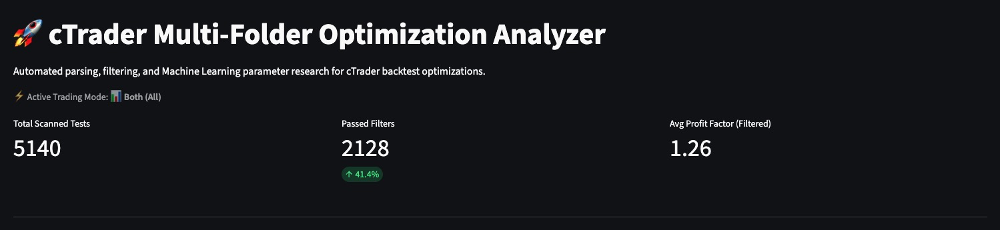
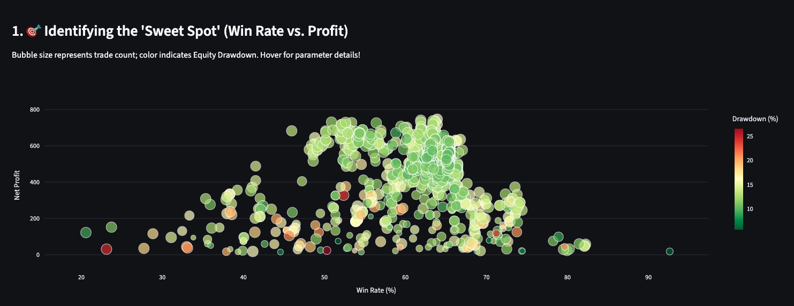
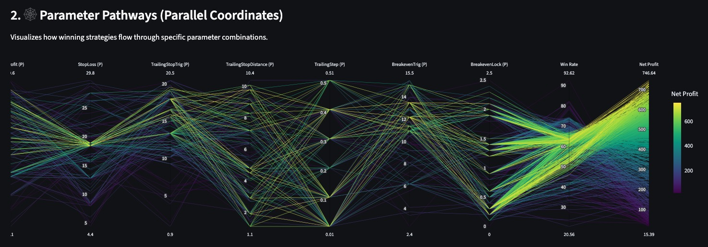
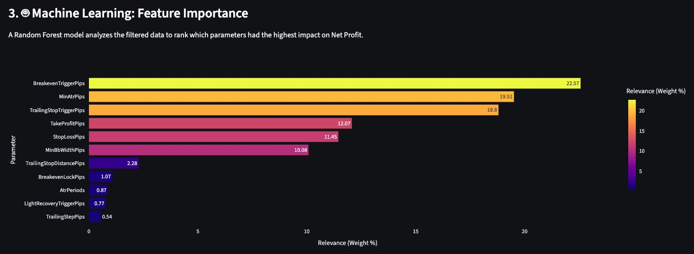
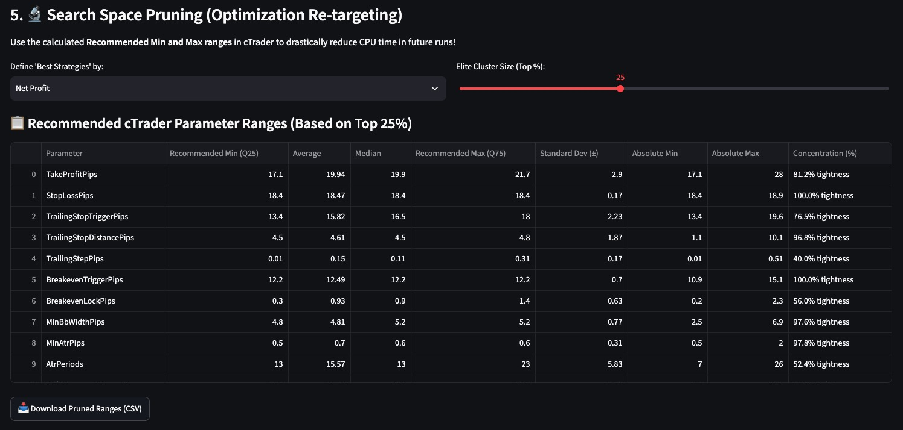
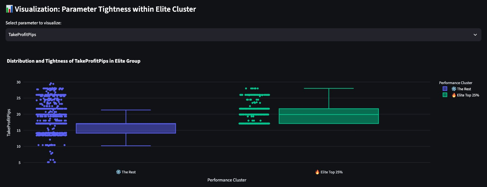
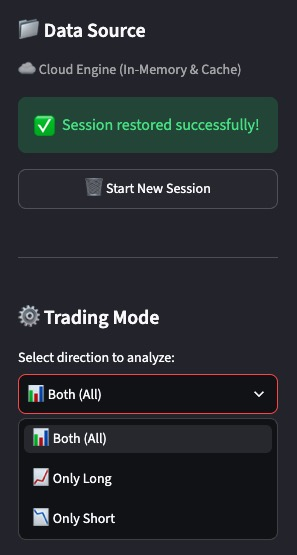
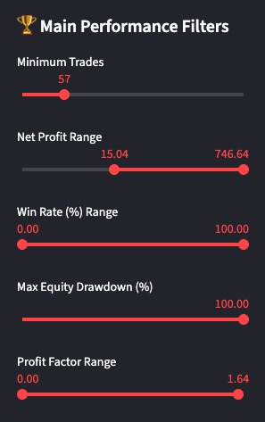
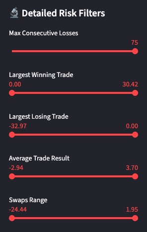

# 🚀 cTrader Multi-Folder Optimization Analyzer



A lightning-fast, highly optimized Python/Streamlit dashboard designed to parse, filter, and analyze massive cTrader algorithmic backtest optimizations. 

Built with a strict **"Data Engineering Pipeline"** mindset, this tool is designed to eliminate market noise, prevent curve-fitting, and drastically reduce your future CPU optimization time by pruning the parameter search space using Machine Learning.

---

## 🎯 Our Mission: The Right Tool for the Right Job

In algorithmic trading, especially when dealing with complex Pattern Signal indicator bots, there is a massive temptation to feed gigabytes of raw, multi-dimensional optimization data directly into an AI/LLM to "find the best settings." **This approach is deeply flawed.** It is computationally expensive, environmentally taxing, and highly susceptible to hallucinations caused by market noise.

This project implements a proper **Flow of Evaluation**:
1. **Heavy Lifting:** High-performance Python (Pandas) crunches gigabytes of raw `.cbotset` and `.html` reports in-memory, bypassing slow disk I/O.
2. **Noise Filtering:** Statistical anomalies and over-optimized passes are filtered out via strict risk metrics.
3. **ML Feature Importance:** A Random Forest algorithm objectively ranks which parameters actually drive profitability.
4. **Visual Distillation:** Millions of data points are compressed into lightweight, interactive Plotly charts.

*By the time the data reaches the final decision-making phase, the "noise" is gone, leaving you (or an AI agent) with pure, actionable trading intelligence.*

---

## ✨ Key Features & Usage Guide

This dashboard was specifically tested and built for complex cBots (like Pattern Signal Indicators) where parameter pathways are intricate.

### 1. Identifying the 'Sweet Spot'
The interactive bubble chart visualizes the classic **Win Rate vs. Net Profit** dilemma. Bubble size represents trade count, while color indicates Equity Drawdown. This helps you instantly spot clusters of robust, safe strategies rather than isolated, curve-fitted anomalies.



### 2. Parameter Pathways (Parallel Coordinates)
Trace the DNA of winning strategies. This chart visualizes how high-performing settings flow through specific parameter combinations (e.g., StopLoss, Trailing Step, Breakeven triggers).



### 3. Machine Learning: Feature Importance
Stop guessing which parameter matters. A built-in **Random Forest** model analyzes your filtered dataset and ranks the parameters by their actual impact on Net Profit.



### 4. Search Space Pruning (Optimization Re-targeting)
**The Ultimate Time Saver:** The analyzer isolates the top "Elite Cluster" (e.g., Top 25%) and calculates the exact statistical boundaries for each parameter. Use these exact `Min` and `Max` ranges in your next cTrader optimization run to reduce CPU time by up to 90%!




### 5. Deep Risk Filtering
Filter your raw data using strict institutional-grade metrics via the sidebar: Max Consecutive Losses, Largest Losing Trade, Minimum Trade Count, and Swap impacts.

  

---

## 🏗️ Architecture & Cloud Readiness

This application is built for maximum efficiency and can be hosted for free on platforms like **Streamlit Community Cloud**:
* **In-Memory ZIP Streaming:** Processes massive cTrader optimization ZIP files without extracting them to disk (bypassing cloud storage limits).
* **Lazy Garbage Collection:** Actively manages RAM by cleaning up expired Parquet cache files and unreferenced dataframes to stay within the 1GB free-tier memory limit.
* **Smart Caching:** Data is aggressively downcast and saved as lightweight `.parquet` files, utilizing URL Query Parameters to maintain sessions seamlessly.

---

## 💻 Installation (Local Mode)

If you want to process massive backtests locally using your SSD:

1. Clone the repository:
   ```bash
   git clone ...
   cd ctrader-optimization-analyzer
   ```

2. Create a virtual environment and install dependencies:
   ```bash
   python -m venv .venv
   source .venv/bin/activate  # On Windows: .venv\Scripts\activate
   pip install -r requirements.txt
   ```

3. Run the application:
   ```bash
   streamlit run app.py
   ```

---

## ☁️ Cloud Deployment Instructions

🔗 **[Live Cloud Demo: Click Here to Try The Analyzer](https://ctrader-optimization-dashboard.streamlit.app/)**

---

## 👨‍💻 Author & Support

**Created by Balázs Kulcsár**

*Solution Architect & Full-Stack Developer*

I build high-performance cTrader bots, advanced technical indicators, and data-driven analytical dashboards. My philosophy is simple: **use the right tool for the job.** I focus on bringing institutional-grade infrastructure to the retail algorithmic trading community.

If this tool has saved you hours of CPU optimization time, helped you avoid curve-fitting, or found your next profitable pattern signal strategy, consider supporting the project! Your support directly fuels the development of more free, open-source trading infrastructure.

---

## ⚖️ License

This software is distributed under the **Business Source License 1.1**.
It is free for personal, academic, and non-commercial algorithmic trading evaluation. Integration into commercial proprietary trading firm infrastructure, paid SaaS, or any revenue-generating product requires a separately negotiated Commercial License. See `LICENSE.md` for full details and risk disclaimers.
